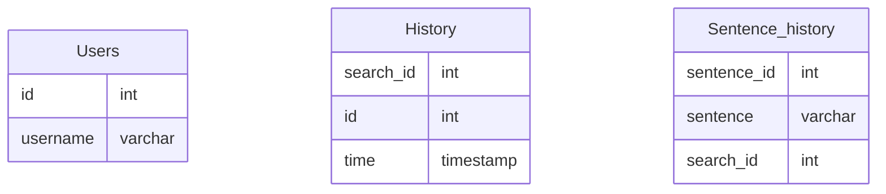
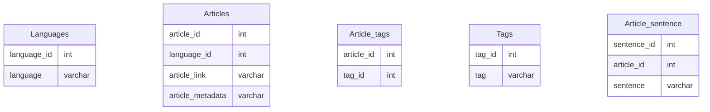

# Plagarism_checker_application
This is an application designed to check for plaigarism between text by matching it against a database of articles from the [National digital library](https://ndl.iitkgp.in).
the plagarism checker has 4 modules

## Database Schema


## Instructions to run the application on your local system
### Requirements
- Python `ver 3.7.1` or newer
- Postgres `ver 13.4` or newer
### Database:
- Create a postgresql database with name `Sih-ver1` 
- (Run this script to add the Schema)[https://github.com/MASHOD0/Plagarism_checker_application/blob/main/src/DB/sql/create.sql]
- update the user credentials in `src/DB/db.py`
- If the credentials are not updated 
    - by default the user is `postgres`
    - by default the password is `postgres`
### Python package requirements:
- All the required python packages can be installed by using pip to install the requirements in (requirements.txt)[https://github.com/MASHOD0/Plagarism_checker_application/blob/main/src/requirements.txt]
```bash
pip install -r requirements.txt
```
## File Structure
```
📦src
 ┣ 📂.ipynb_checkpoints
 ┣ 📂DB
 ┃ ┣ 📂sql
 ┃ ┃ ┗ 📜create.sql
 ┃ ┣ 📂__pycache__
 ┃ ┃ ┣ 📜db.cpython-39.pyc
 ┃ ┃ ┗ 📜query.cpython-39.pyc
 ┃ ┣ 📜db.py
 ┃ ┗ 📜query.py
 ┣ 📜demo.py
 ┣ 📜history.py
 ┣ 📜input.py
 ┣ 📜main.py
 ┣ 📜report.py
 ┣ 📜test.py
 ┣ 📂NLP
 ┃ ┣ 📂.ipynb_checkpoints
 ┃ ┃ ┗ 📜indic_nlp_examples-checkpoint.ipynb
 ┃ ┣ 📂indic_nlp_library
 ┃ ┃ ┣ 📂contrib
 ┃ ┃ ┃ ┣ 📜correct_moses_tokenizer.py
 ┃ ┃ ┃ ┣ 📜hindi_to_kannada_transliterator.py
 ┃ ┃ ┃ ┣ 📜indic_scraper_project_sample.ipynb
 ┃ ┃ ┃ ┗ 📜README.md
 ┃ ┃ ┣ 📂docs
 ┃ ┃ ┃ ┣ 📜cmd.rst
 ┃ ┃ ┃ ┣ 📜code.rst
 ┃ ┃ ┃ ┣ 📜conf.py
 ┃ ┃ ┃ ┣ 📜index.rst
 ┃ ┃ ┃ ┣ 📜indicnlp.cli.rst
 ┃ ┃ ┃ ┣ 📜indicnlp.MD
 ┃ ┃ ┃ ┣ 📜indicnlp.morph.rst
 ┃ ┃ ┃ ┣ 📜indicnlp.normalize.rst
 ┃ ┃ ┃ ┣ 📜indicnlp.pdf
 ┃ ┃ ┃ ┣ 📜indicnlp.rst
 ┃ ┃ ┃ ┣ 📜indicnlp.script.rst
 ┃ ┃ ┃ ┣ 📜indicnlp.syllable.rst
 ┃ ┃ ┃ ┣ 📜indicnlp.tokenize.rst
 ┃ ┃ ┃ ┣ 📜indicnlp.transliterate.rst
 ┃ ┃ ┃ ┣ 📜make.bat
 ┃ ┃ ┃ ┣ 📜Makefile
 ┃ ┃ ┃ ┗ 📜modules.rst
 ┃ ┃ ┣ 📂indicnlp
 ┃ ┃ ┃ ┣ 📂cli
 ┃ ┃ ┃ ┃ ┣ 📜cliparser.py
 ┃ ┃ ┃ ┃ ┗ 📜__init__.py
 ┃ ┃ ┃ ┣ 📂morph
 ┃ ┃ ┃ ┃ ┣ 📂__pycache__
 ┃ ┃ ┃ ┃ ┃ ┣ 📜unsupervised_morph.cpython-39.pyc
 ┃ ┃ ┃ ┃ ┃ ┗ 📜__init__.cpython-39.pyc
 ┃ ┃ ┃ ┃ ┣ 📜unsupervised_morph.py
 ┃ ┃ ┃ ┃ ┗ 📜__init__.py
 ┃ ┃ ┃ ┣ 📂normalize
 ┃ ┃ ┃ ┃ ┣ 📂__pycache__
 ┃ ┃ ┃ ┃ ┃ ┣ 📜indic_normalize.cpython-39.pyc
 ┃ ┃ ┃ ┃ ┃ ┗ 📜__init__.cpython-39.pyc
 ┃ ┃ ┃ ┃ ┣ 📜indic_normalize.py
 ┃ ┃ ┃ ┃ ┗ 📜__init__.py
 ┃ ┃ ┃ ┣ 📂script
 ┃ ┃ ┃ ┃ ┣ 📂__pycache__
 ┃ ┃ ┃ ┃ ┃ ┣ 📜english_script.cpython-39.pyc
 ┃ ┃ ┃ ┃ ┃ ┣ 📜indic_scripts.cpython-39.pyc
 ┃ ┃ ┃ ┃ ┃ ┣ 📜phonetic_sim.cpython-39.pyc
 ┃ ┃ ┃ ┃ ┃ ┗ 📜__init__.cpython-39.pyc
 ┃ ┃ ┃ ┃ ┣ 📜english_script.py
 ┃ ┃ ┃ ┃ ┣ 📜indic_scripts.py
 ┃ ┃ ┃ ┃ ┣ 📜phonetic_sim.py
 ┃ ┃ ┃ ┃ ┗ 📜__init__.py
 ┃ ┃ ┃ ┣ 📂syllable
 ┃ ┃ ┃ ┃ ┣ 📂__pycache__
 ┃ ┃ ┃ ┃ ┃ ┣ 📜syllabifier.cpython-39.pyc
 ┃ ┃ ┃ ┃ ┃ ┗ 📜__init__.cpython-39.pyc
 ┃ ┃ ┃ ┃ ┣ 📜syllabifier.py
 ┃ ┃ ┃ ┃ ┗ 📜__init__.py
 ┃ ┃ ┃ ┣ 📂test
 ┃ ┃ ┃ ┃ ┣ 📂unit
 ┃ ┃ ┃ ┃ ┃ ┗ 📜__init__.py
 ┃ ┃ ┃ ┃ ┗ 📜__init__.py
 ┃ ┃ ┃ ┣ 📂tokenize
 ┃ ┃ ┃ ┃ ┣ 📂__pycache__
 ┃ ┃ ┃ ┃ ┃ ┣ 📜indic_detokenize.cpython-39.pyc
 ┃ ┃ ┃ ┃ ┃ ┣ 📜indic_tokenize.cpython-39.pyc
 ┃ ┃ ┃ ┃ ┃ ┣ 📜sentence_tokenize.cpython-39.pyc
 ┃ ┃ ┃ ┃ ┃ ┗ 📜__init__.cpython-39.pyc
 ┃ ┃ ┃ ┃ ┣ 📜indic_detokenize.py
 ┃ ┃ ┃ ┃ ┣ 📜indic_tokenize.py
 ┃ ┃ ┃ ┃ ┣ 📜sentence_tokenize.py
 ┃ ┃ ┃ ┃ ┗ 📜__init__.py
 ┃ ┃ ┃ ┣ 📂transliterate
 ┃ ┃ ┃ ┃ ┣ 📂__pycache__
 ┃ ┃ ┃ ┃ ┃ ┣ 📜sinhala_transliterator.cpython-39.pyc
 ┃ ┃ ┃ ┃ ┃ ┣ 📜unicode_transliterate.cpython-39.pyc
 ┃ ┃ ┃ ┃ ┃ ┗ 📜__init__.cpython-39.pyc
 ┃ ┃ ┃ ┃ ┣ 📜acronym_transliterator.py
 ┃ ┃ ┃ ┃ ┣ 📜script_unifier.py
 ┃ ┃ ┃ ┃ ┣ 📜sinhala_transliterator.py
 ┃ ┃ ┃ ┃ ┣ 📜unicode_transliterate.py
 ┃ ┃ ┃ ┃ ┗ 📜__init__.py
 ┃ ┃ ┃ ┣ 📂__pycache__
 ┃ ┃ ┃ ┃ ┣ 📜common.cpython-39.pyc
 ┃ ┃ ┃ ┃ ┣ 📜langinfo.cpython-39.pyc
 ┃ ┃ ┃ ┃ ┣ 📜loader.cpython-39.pyc
 ┃ ┃ ┃ ┃ ┗ 📜__init__.cpython-39.pyc
 ┃ ┃ ┃ ┣ 📜common.py
 ┃ ┃ ┃ ┣ 📜langinfo.py
 ┃ ┃ ┃ ┣ 📜loader.py
 ┃ ┃ ┃ ┣ 📜version.txt
 ┃ ┃ ┃ ┗ 📜__init__.py
 ┃ ┃ ┣ 📂test_data
 ┃ ┃ ┃ ┣ 📂morph
 ┃ ┃ ┃ ┃ ┗ 📜mr.txt
 ┃ ┃ ┃ ┣ 📂normalize
 ┃ ┃ ┃ ┃ ┣ 📜bn.txt
 ┃ ┃ ┃ ┃ ┣ 📜en.txt
 ┃ ┃ ┃ ┃ ┣ 📜gu.txt
 ┃ ┃ ┃ ┃ ┣ 📜hi.txt
 ┃ ┃ ┃ ┃ ┣ 📜kK.txt
 ┃ ┃ ┃ ┃ ┣ 📜ma.txt
 ┃ ┃ ┃ ┃ ┣ 📜mr.txt
 ┃ ┃ ┃ ┃ ┣ 📜pa.txt
 ┃ ┃ ┃ ┃ ┣ 📜ta.txt
 ┃ ┃ ┃ ┃ ┣ 📜te.txt
 ┃ ┃ ┃ ┃ ┗ 📜ur.txt
 ┃ ┃ ┃ ┣ 📂tokenize
 ┃ ┃ ┃ ┃ ┗ 📜trivial.txt
 ┃ ┃ ┃ ┗ 📜transliterate.ipynb
 ┃ ┃ ┣ 📜LICENSE
 ┃ ┃ ┣ 📜README.md
 ┃ ┃ ┣ 📜requirements.txt
 ┃ ┃ ┗ 📜setup.py
 ┃ ┣ 📂indic_nlp_resources
 ┃ ┃ ┣ 📂morph
 ┃ ┃ ┃ ┗ 📂morfessor
 ┃ ┃ ┃ ┃ ┣ 📜bn.model
 ┃ ┃ ┃ ┃ ┣ 📜gu.model
 ┃ ┃ ┃ ┃ ┣ 📜hi.model
 ┃ ┃ ┃ ┃ ┣ 📜kK.model
 ┃ ┃ ┃ ┃ ┣ 📜kn.model
 ┃ ┃ ┃ ┃ ┣ 📜ml.model
 ┃ ┃ ┃ ┃ ┣ 📜mr.model
 ┃ ┃ ┃ ┃ ┣ 📜pa.model
 ┃ ┃ ┃ ┃ ┣ 📜sa.model
 ┃ ┃ ┃ ┃ ┣ 📜ta.model
 ┃ ┃ ┃ ┃ ┣ 📜te.model
 ┃ ┃ ┃ ┃ ┗ 📜ur.model
 ┃ ┃ ┣ 📂script
 ┃ ┃ ┃ ┣ 📜all_script_phonetic_data.csv
 ┃ ┃ ┃ ┣ 📜all_script_phonetic_data.xlsx
 ┃ ┃ ┃ ┣ 📜arpabet.pdf
 ┃ ┃ ┃ ┣ 📜english_arpabet_list.csv
 ┃ ┃ ┃ ┣ 📜english_script_phonetic_data.csv
 ┃ ┃ ┃ ┣ 📜english_script_phonetic_data.xlsx
 ┃ ┃ ┃ ┣ 📜tamil_script_phonetic_data.csv
 ┃ ┃ ┃ ┗ 📜tamil_script_phonetic_data.xlsx
 ┃ ┃ ┣ 📂transliterate
 ┃ ┃ ┃ ┣ 📜bn-hi.zip
 ┃ ┃ ┃ ┣ 📜en-hi.zip
 ┃ ┃ ┃ ┣ 📜mr-hi.zip
 ┃ ┃ ┃ ┣ 📜offset_itrans_map.csv
 ┃ ┃ ┃ ┣ 📜README.md
 ┃ ┃ ┃ ┣ 📜ta-hi.zip
 ┃ ┃ ┃ ┗ 📜te-hi.zip
 ┃ ┃ ┗ 📜README.md
 ┃ ┣ 📂__pycache__
 ┃ ┃ ┗ 📜nlp.cpython-39.pyc
 ┃ ┣ 📜indic_nlp_examples.ipynb
 ┃ ┗ 📜nlp.py
 ┣ 📂static
 ┃ ┗ 📜style.css
 ┣ 📂templates
 ┃ ┣ 📜history.html
 ┃ ┣ 📜home.html
 ┃ ┣ 📜index.html
 ┃ ┣ 📜login.html
 ┃ ┣ 📜main.html
 ┃ ┣ 📜register.html
 ┃ ┣ 📜results.html
 ┃ ┗ 📜__init__.py
 ┣ 📂__pycache__
 ┃ ┣ 📜demo.cpython-39.pyc
 ┃ ┣ 📜history.cpython-39.pyc
 ┃ ┗ 📜report.cpython-39.pyc
 ┗ 📜test1.py
 ```
